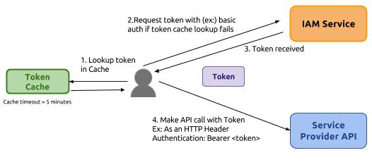

# TokenCacheMediation
A sample Synapse configuration that demonstrates the use of the Cache mediator in a Token based authentication scenario.

### User Story

### Mediation Flow

Refer to my [blog post](https://medium.com/@chamilad/sample-wso2-ei-cache-mediator-based-token-caching-3036f2e7e6eb) for a more detailed explanation.
